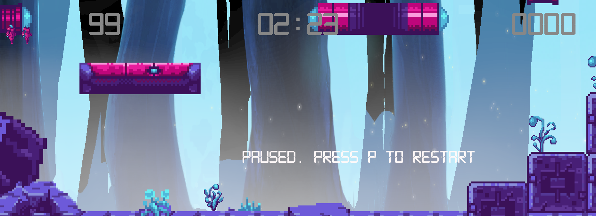

# Ultimate Warrior

## GAME DESIGN DOCUMENT

Creado por: Jose Luis Varela Ledo

Versión del documento: 1.0

## HISTORIAL DE REVISIONES

| Versión | Fecha | Comentarios |
| 1.00 | 2024/04/20 | Creación del documento |
| < versión > | < fecha > | < comentario > |

## RESUMEN

### Concepto

Seguimos las aventuras de Unity, una marine espacial encargada de la vigilancia pandimensional.

 El teseracto que le permite saltar entre diferentes puntos dimensionales ha sufrido un desperfecto, y no encuentra el camino de vuelta a casa. En los diferentes saltos termina en sitios donde no querrías estar, mientras busca el lugar donde se encuentra el ArchiMaestre, el único capaz de reparar su artefacto transdimensional.
### Puntos Clave
1. **Misiones con diferentes mecánicas, desarrollo y objetivos**
- Misiones de supervivencia
- Misiones de recolección de recursos
- Misiones en las que hay que destruir un número determinado de enemigos
- Misiones de escape: hay que encontrar la salida en un tiempo determinado
2. **Capacidades Unity**
- Salto: implementado
- Disparo: implementado
- Doble salto: sin implementar todavía
- Invulnerabilidad: sin implementar todavía
3. **Potenciadores**
- Recarga de salud: implementado
- Poción de invulnerabilidad: sin implementar
4. **Armas**
- Cañón principal: implementado
- Bombas: sin implementar
5. **Enemigos**
Enemigos con comportamientos diferentes, que requieran adaptación de las estrategias del jugador.

### Género

**Plataformas 2D** Arcade, con toques de MetroidVania. En el prototipo están sin implementar las mejoras de Unity, se añadirían en posteriores fases.
Mundo cerrado, con fases autoconclusivas que van llevando al personaje principal de fase en fase hasta ir superando mundos, y llegando hasta la conclusión.

### Plataforma
El concepto es portable a cualquier plataforma, ya que, aunque la dinámica de los controles invita a ser usando en PC con teclado, o en consola con gamepad, no tiene un control demasiado difícil, por lo cual se podría implementar perfectamente en plataformas móviles con pantalla táctil usando un gamepad virtual, y no tiene unos requerimientos de hardware muy elevados.

### Público Objetivo

Jugadores ocasionales con preferencias por el Arcade de los **80´s**, **90´s**.

### Experiencia de Juego

El jugador se trasladará a un arcade de claro sabor ochentero, con una ambientación gráfica y sonora que recuerda a aventuras ciberpunk de la época.

## DISEÑO

### Metas de Diseño

Se apela a la nostalgia del jugador que vivió sus primeros acercamientos al videojuego en la década de los 80, pero sin descuidar al jugador actual. El target principal es el primer grupo, de modo que la ambientación sonora, el acabado pixelado y la gama de colores le remita a los tipos de juego con los que se introdujo en mundo arcade. Música synthwave, ambientación sci-fi, con decorados y enemigos de aspecto alienígena, con toques futuristas.

## MECÁNICAS DE JUEGO

### Núcleo de Juego

En el juego controlaremos a un avatar que tiene que ir saltando de misión en misión, enfrentada en prácticamente todos los niveles a enemigos inacabables que ralentizan o impiden la consecución de los objetivos de la misión. Empezaremos con una capacidad simple de salto (que, ayudada de los apoyos en paredes y esquinas, consigue llegar a sitios aparentemente inaccesibles) en diferentes escenarios en los que la única defensa es el cañón con el que destruir a los enemigos. Las plataformas son rígidas, no permiten llegar a ellas desde su zona inferior.

Posteriormente, según avanzan las misiones, que son autoconclusivas, pero con objetivos diferentes (habrá misiones de simple supervivencia, de adquisición de objetos, escape-room, jefes finales, consecución de cierto umbral de bajas enemigas,...), el avatar del personaje irá consiguiendo potenciadores permanentes para aumentar sus capacidades (doble salto, cañón más potente, armas secundarias, bombas de aniquilación en un área determinada, blindaje,...) y potenciadores puntuales (invulnerabilidad, vidas extra, recarga de salud, ralentización de enemigos,...).
Se tratará de un mundo cerrado sin posibilidad de revisitar misiones ya concluidas.

### Flujo de Juego

{width=600px height=400px}
Tras iniciar el juego se ve una pantalla estática con el avatar del jugador en su animación "idle", con una música de fondo, y unas letras fluctuantes con el título, y la indicación de que se presione cualquier tecla para iniciar partida, también fluctuantes. Minimalista.
Al pulsar cualquier tecla se accede a una pantalla donde sólo se indican los controles, que se puede saltar pulsando cualquier tecla, o bien esperando a que la cuenta regresiva de 10 llegue a cero.
En esta demo sólo están implementados dos niveles, de modo que empezamos el primero, que es de supervivencia. Si no sobrevivimos el tiempo indicado, perdiendo todas nuestras vidas, se pasa a la pantalla de GameOver, donde sobre un fondo, se indica que se pulse cualquier tecla; de hacerlo, nos devuelve a la pantalla de instrucciones.
De sobrevivir, pasamos del nivel al siguiente, pero antes hay una nueva pantalla de instrucciones donde se nos indica que el objetivo de esta misión es conseguir un número determinado de items. Si los conseguimos antes de terminar el tiempo, pasamos al siguiente nivel, que, dado que todavía no existe, nos lleva a la pantalla de GameOver. De no completar la misión en el tiempo indicado, se pierde vida, y se reinicia el nivel, manteniendo la puntuación que tuviésemos antes de perder la vida. Si terminamos todas las vidas, nos lleva a la pantalla de GameOver.
En cualquier momento es posible pausar el juego pulsando la tecla P, o bien salir, pulsando la tecla Escape.
### Fin de Juego

Se termina la partida en las siguientes situaciones:
- Pérdida de todas las vidas
- Consecución de todas las fases (en esta demo sólo hay dos)
- Tecla escape: termina la partida

### Física de Juego

El juego transcurre en esta demo sobre dos escenarios similares, con un suelo rígido y plataformas accesibles desde su parte inferior (usando el Platform effector de Unity), con unas fuerzas y una gravedad constante.
En estos niveles todavía no existen variaciones en los parámetros físicos, pero en futuros niveles la gravedad será diferente, la capacidad de salto se verá afectada, y habrá zonas de trampas, zonas viscosas que impiden el avance, zonas resbaladizas, zonas que produzcan daño...
### Controles

- **Teclas de movimiento**: cursores, o bien teclas ASDW. 
- **Salto**: barra espaciadora
- **Disparo**: tecla M
- **Pausa**: tecla P
- **Salir del juego**: tecla Escape
- **Transición entre pantallas que lo permitan**: cualquier tecla

## MUNDO DEL JUEGO

### Descripción General

Escenarios de apariencia alienígena, con toques futuristas. Inspiración en Geiger, y los espacios claustrofóbicos a la par que amenazantes, con aspectos reconocibles y extraños al mismo tiempo, dando sensación de extrañeza. Paleta de colores saturada, muy arcade. Elementos que simulan vestigios arqueológicos de civilizaciones extrañas.

### Personajes
1. **Personaje principal**
   Unity, la heroína del juego.
   
2. **Enemigos**
- **Octogoblin**: una especie de pulpo muy rápido que se pega a la cabeza de sus enemigos, y drena su energía
  
- **ArmorCrab**: un robusto cangrejo gigante lento pero poderoso
  
- **Jumper**: un insectoide que dispara chorros de energía
- **Slime**: agresivo ser que ataca con su cuerpo gelatinoso
- **Ghost**: ser flotante que dispara pulsos de energía
  
- **SwampThing**: lento pero correoso enemigo que no ceja en su persecución
- **AlienSpider**: rápido y mortal, con forma aracnoide
  
3. **Jefes finales**
   Sin implementar.
   

### Objetos

1. **Potenciadores instantáneos de un solo uso**
   - Heart: aumento de salud de 25 puntos
2. **Coleccionables**
   - Energy: orbe de energía necesario para la consecución de las misiones que lo requieran
3. **Potenciadores permanentes** (por implementar)  

### Flujo de Pantallas

{width=600px height=400px}

Tras iniciar el juego se ve una pantalla estática con el avatar del jugador en su animación "idle", con una música de fondo, y unas letras fluctuantes con el título, y la indicación de que se presione cualquier tecla para iniciar partida, también fluctuantes. Minimalista.

Al pulsar cualquier tecla se accede a una pantalla donde sólo se indican los controles, que se puede saltar pulsando cualquier tecla, o bien esperando a que la cuenta regresiva de 10 llegue a cero.

En esta demo sólo están implementados dos niveles, de modo que empezamos el primero, que es de supervivencia. Si no sobrevivimos el tiempo indicado, perdiendo todas nuestras vidas, se pasa a la pantalla de GameOver, donde sobre un fondo, se indica que se pulse cualquier tecla; de hacerlo, nos devuelve a la pantalla de instrucciones.

De sobrevivir, pasamos del nivel al siguiente, pero antes hay una nueva pantalla de instrucciones donde se nos indica que el objetivo de esta misión es conseguir un número determinado de items. Si los conseguimos antes de terminar el tiempo, pasamos al siguiente nivel, que, dado que todavía no existe, nos lleva a la pantalla de GameOver. De no completar la misión en el tiempo indicado, se pierde vida, y se reinicia el nivel, manteniendo la puntuación que tuviésemos antes de perder la vida. Si terminamos todas las vidas, nos lleva a la pantalla de GameOver.

En cualquier momento es posible pausar el juego pulsando la tecla P, o bien salir, pulsando la tecla Escape.

### HUD

- A la **izquierda, en la parte superior**, vemos las vidas restantes que nos quedan, en formna de avatar en miniatura del jugador.
- El **99** que vemos es la salud restante.
- Los guarismos **2:25** son el tiempo restante que queda en este nivel.
- **0000**: indica la puntuación actual
  

Al pulsar **P**, y por tanto poner el juego en pausa, vamos que todos los elementos del HUD se mantienen, pero desaparece el avatar el jugador, y se visualiza un mensaje de que el juego está pausado, y cómo restablecerlo.

Vemos cómo, en la segunda fase, se añade a los elementos presentes anteriormente una **esfera de energía**, en forma de orbe, y un **contador** (actualmente 5), que nos indica las que faltan por conseguir para completar las necesarias para este nivel.

Si se produce un Game Over vemos que el contador de puntuación muestra el mensaje **DEAD**, y en pantalla aparece el mensaje **GAME OVER**.

## ARTE

### Metas de Arte

El objetivo es orientar el arte a un tipo pixel-art, que nos lleve a una estética de arcade de los 80´s, con escenarios alienígenas, cuevas claustrofóbicas, con un fondo apocalíptico, inquietante, y una decoración acorde. La idea es acercarse a la estética de la película Prometheus, pero llevado a un juego pixel-art de tipo arcade 2D.

### Assets de Arte

- **Sprites**
  - ***Personaje***: tenemos sprites para los diferentes estados del avatar del jugador: parado, corriendo, saltando, disparando tanto de pie como corriendo, recepeción de un impaco...
  - ***Enemigos***: disponemos de los sprites para todos los enemigos desarrollados hasta el momento, siete en total, con diferentes animaciones para cada estado.
- **Fx**:
  - ***Muertes***: animaciones diferentes para la muerte del jugador (hay dos a elegir, convertidas en Prefab) y los enemigos
  - ***Impactos***: cuando un personaje recibe un impacto, dicho impacto cuenta con su propia animación
  - ***Powerups***: sprites (convertidos en prefab) para los potenciadores implementados hasta el momento
  - ***Disparos***: tanto los disparos del jugador como los de los enemigos tienen su correspondiente sprite, convertido a prefab
- **Tilesets**: disponemos de los tilesets para la creación de los escenarios, tanto para las plataformas, como elementos físicos, así como elementos decorativos
- **Scroll de fondo**: disponemos de diferentes elementos para la creación de fondos que simulan movimiento con efecto de paralaje.
-  **Imágenes para la pantalla de GameOver**
-  **Prefabs** creados para animaciones, personajes, disparos y powerups.

## AUDIO

### Metas de Audio

El enfoque sonoro es el propio de un arcade de los 80, con muchos elementos SynthWave, muy melódicos, "machacones" y pegadizos, con efectos sonoros acordes a la ambientación ochentera que se quiere aportar.

### Assets de Audio

- **Música**: disponemos de temas diferentes para la pantalla introductoria, las pantallas de transición/instrucciones, y cada escenario, así como la pantalla de gameOver, todas en la misma línea.
- **Efectos sonoros**: clips de audio diferenciados para disparos (enemigos y personaje tienen diferente sonido), acciones del personaje (salto, disparo, recepción de daño, muerte), impacto en enemigos, y destrucción de éstos, como para acciones (pausa/reanudación del juego, gameOver, consecución exitosa de fase).

## DETALLES TÉCNICOS

### Plataformas Objetivo

El concepto es portable a cualquier plataforma, ya que, aunque la dinámica de los controles invita a ser usando en PC con teclado, o en consola con gamepad, no tiene un control demasiado difícil, por lo cual se podría implementar perfectamente en plataformas móviles con pantalla táctil usando un gamepad virtual, y no tiene unos requerimientos de hardware muy elevados.

### Herramientas de Desarrollo

- **Motor de juego**: Unity Engine 2023.1.16f1
- **Assets**: tileset y personajes, Asset Store de Unity
- **Sonido**
  - ***Música***: música arcade libre de derechos
  - ***Sonidos***: repositorio de sonidos de juegos arcade libres de derechos
- **Arte**: plataformas de IA, fundamentalmente Adobe.
- **Scripting**: Visual Studio Code con plugins y snippets para C#.
  
